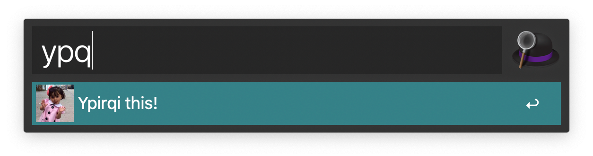

# Ypirqi for Alfred

**Ypirqi for Alfred** is a simple workflow inspired by [Juan Alonso’s Ypirqui for Slack](https://github.com/juanalonso/ypirqui)

It is a quick shortcut to mock someone by copying a string and replace all the vowels with an `i`. Then you can paste it wherever you need it. **Use it wisely**.

## Requirements

Well, you need [Alfred app for Mac](https://www.alfredapp.com)

## Installation

Download the **.alfredworkflow** file, doubleclick it and you are ready to bring justice to your favourite messaging app or social network timeline!

## How to use it

1. Wait for this someone to say something… 
2. Copy her/his text
3. Launch Alfred window
4. Type `ypq`
5. Now you have the text ready in you clipboard to paste it and answer with style.

Yep, that’s all :)
